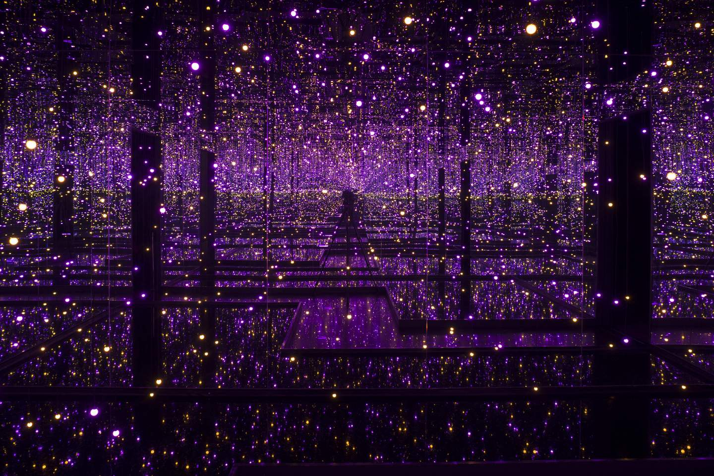

# Quiz 8
## Part 1
I am inspired by **Yayoi Kusama’s** immersive polka-dot installations, especially the way repeated dots gradually cover objects, walls and space. Dynamically growing dots are not just flat patterns. I hope they appear, expand and accumulate over time, creating a sense of movement and visual transformation. 
>Example: 

## Part 2
A useful coding technique I found is **animated circle packing**. In this technique, circles are generated and grown in random positions until they touch the edge of another circle or canvas. This can help me create points inspired by Kusama, which can be expanded organically without overlapping too much. By adding colors, mouse interaction or timing generation, these points can feel like growing on the screen.

>Example:
[CC 50 Circle Packing Basic](https://editor.p5js.org/codingtrain/sketches/XNhNJ3OVn?utm_source=chatgpt.com)
