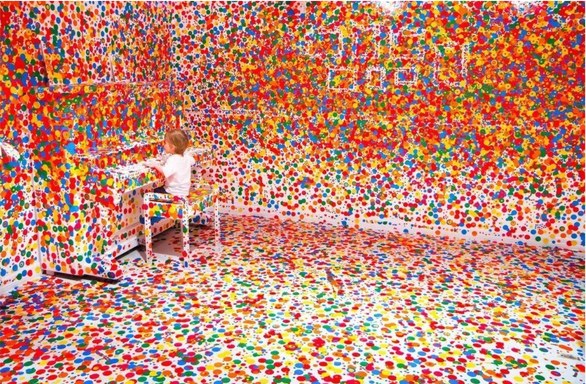
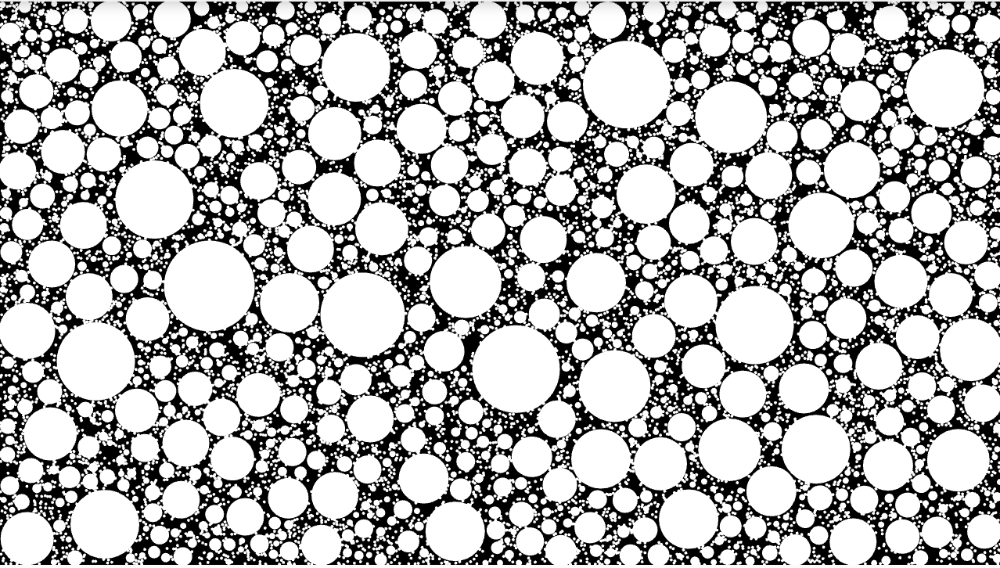

# Quiz 8
## Part 1
### Inspiration: Yayoi Kusama’s Polka Dot Installations
I am inspired by **Yayoi Kusama’s** Polka Dot Installations, especially *The Obliteration Room* and *Infinity Mirrored Room*. I want to incorporate the technique of repeated dots as symbols of life, growth and energy. In my project, the dots will appear and expand across a plain or desolate background, gradually changing it from quiet and lifeless into something vivid and immersive. These simple circular forms can create a strong sense of movement, transformation and growth through code.
>Example: 

## Part 2
### Coding Technique: Animated Circle Packing in p5.js
A useful coding technique I found is **Animated Circle Packing**. In this technique, circles are *generated and grown in random positions* until they *touch the edge of another circle or canvas*. This can help me create points inspired by Kusama, which can be expanded organically without overlapping too much. By adding colors, mouse interaction or timing generation, these points can feel like growing on the screen like **Popping Circles**. 
>Example:
[CC 50 Circle Packing Basic](https://editor.p5js.org/codingtrain/sketches/XNhNJ3OVn?utm_source=chatgpt.com)
[Popping Circles](https://editor.p5js.org/KevinWorkman/sketches/yAiMP42Gs)
